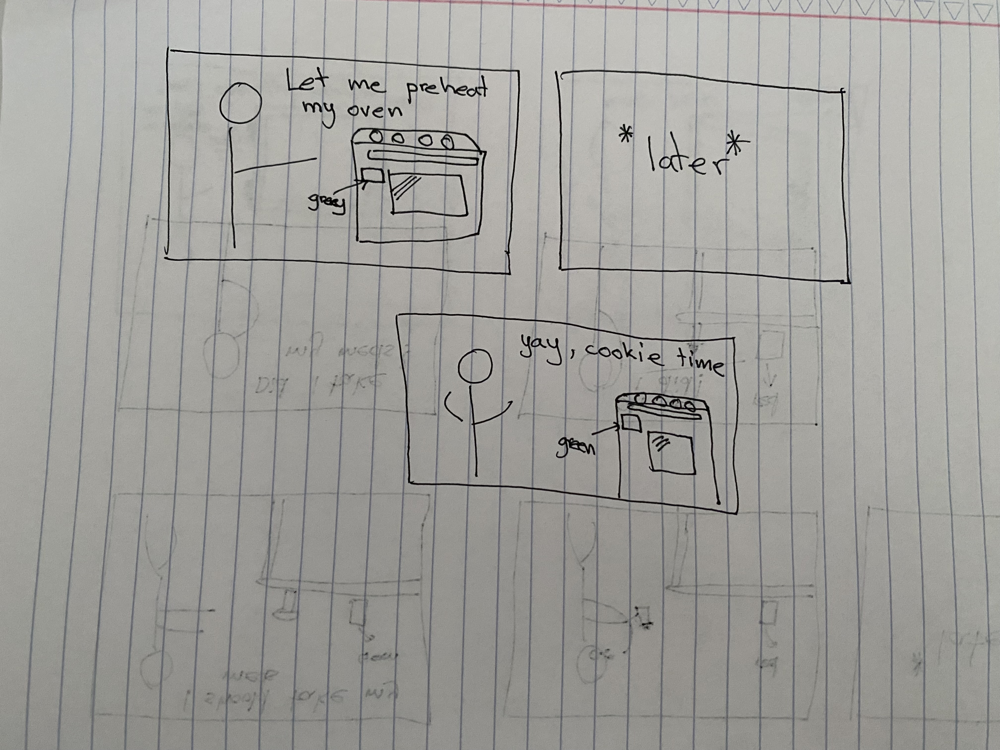

# Staging Interaction

In the original stage production of Peter Pan, Tinker Bell was represented by a darting light created by a small handheld mirror off-stage, reflecting a little circle of light from a powerful lamp. Tinkerbell communicates her presence through this light to the other characters. See more info [here](https://en.wikipedia.org/wiki/Tinker_Bell). 

There is no actor that plays Tinkerbell--her existence in the play comes from the interactions that the other characters have with her.

For lab this week, we draw on this and other inspirations from theatre to stage interactions with a device where the main mode of display/output for the interactive device you are designing is lighting. You will plot the interaction with a storyboard, and use your computer and a smartphone to experiment with what the interactions will look and feel like. 

_Make sure you read all the instructions and understand the whole of the laboratory activity before starting!_

## Prep

### To start the semester, you will need:
1. Read about Git [here](https://git-scm.com/book/en/v2/Getting-Started-What-is-Git%3F).
2. Set up your own Github "Lab Hub" repository to keep all you work in record by [following these instructions](https://github.com/FAR-Lab/Developing-and-Designing-Interactive-Devices/blob/2021Fall/readings/Submitting%20Labs.md).
3. Set up the README.md for your Hub repository (for instance, so that it has your name and points to your own Lab 1) and [learn how to](https://guides.github.com/features/mastering-markdown/) organize and post links to your submissions on your README.md so we can find them easily.

### For this lab, you will need:
1. Paper
2. Markers/ Pens
3. Scissors
4. Smart Phone -- The main required feature is that the phone needs to have a browser and display a webpage.
5. Computer -- We will use your computer to host a webpage which also features controls.
6. Found objects and materials -- You will have to costume your phone so that it looks like some other devices. These materials can include doll clothes, a paper lantern, a bottle, human clothes, a pillow case, etc. Be creative!

### Deliverables for this lab are: 
1. 7 Storyboards
1. 3 Sketches/photos of costumed devices
1. Any reflections you have on the process
1. Video sketch of 3 prototyped interactions
1. Submit the items above in the lab1 folder of your class [Github page], either as links or uploaded files. Each group member should post their own copy of the work to their own Lab Hub, even if some of the work is the same from each person in the group.

### The Report
This README.md page in your own repository should be edited to include the work you have done (the deliverables mentioned above). Following the format below, you can delete everything but the headers and the sections between the **stars**. Write the answers to the questions under the starred sentences. Include any material that explains what you did in this lab hub folder, and link it in your README.md for the lab.

## Lab Overview
For this assignment, you are going to:

A) [Plan](#part-a-plan) 

B) [Act out the interaction](#part-b-act-out-the-interaction) 

C) [Prototype the device](#part-c-prototype-the-device)

D) [Wizard the device](#part-d-wizard-the-device) 

E) [Costume the device](#part-e-costume-the-device)

F) [Record the interaction](#part-f-record)

Labs are due on Mondays. Make sure this page is linked to on your main class hub page.

## Part A. Plan 

To stage an interaction with your interactive device, think about:

_Setting:_ Where is this interaction happening? (e.g., a jungle, the kitchen) When is it happening?

_Players:_ Who is involved in the interaction? Who else is there? If you reflect on the design of current day interactive devices like the Amazon Alexa, it’s clear they didn’t take into account people who had roommates, or the presence of children. Think through all the people who are in the setting.

_Activity:_ What is happening between the actors?

_Goals:_ What are the goals of each player? (e.g., jumping to a tree, opening the fridge). 

The interactive device can be anything *except* a computer, a tablet computer or a smart phone, but the main way it interacts needs to be using light.

\*\***Describe your setting, players, activity and goals here.**\*\*

Storyboards are a tool for visually exploring a users interaction with a device. They are a fast and cheap method to understand user flow, and iterate on a design before attempting to build on it. Take some time to read through this explanation of [storyboarding in UX design](https://www.smashingmagazine.com/2017/10/storyboarding-ux-design/). Sketch seven storyboards of the interactions you are planning. **It does not need to be perfect**, but must get across the behavior of the interactive device and the other characters in the scene. 

### _Storyboards_
1. Brushing Teeth Timer

* _Setting:_ Bathroom
* _Players:_ Anyone who is brushing their teeth
* _Activity:_ The actor is brushing their teeth
* _Goals:_ The goal is to brush every quadrant of the mouth for at least 30 seconds

2. Tupperware Status Indicator

* _Setting:_ Kitchen
* _Players:_ People who frequently use the fridge but forget about food expiration dates
* _Activity:_ Actor puts away leftovers or restocks the fridge in tupperware containers
* _Goals:_ To have a quick understanding which food needs to be used first

3. Water fountain level indicator

* _Setting:_ Any place that has water fountain for cats
* _Players:_ Cat owners, cats
* _Activity:_ Actor waves their foot at the fountain to gage the water level of the fountain, then refills if needed
* _Goals:_ To make sure that the cat has enough water in their fountain

4. Indoor AQI Indicator

* _Setting:_ Any room with a window that can open
* _Players:_ Any person who is conscious of air quality
* _Activity:_ Actor checks the AQI reading of the room and opens the window
* _Goals:_ To get fresh clean air and improve the air quality of the room

5. "Last time I took my meds" indicator

* _Setting:_ Kitchen, medicine cabinet
* _Players:_ People who take medication often
* _Activity:_ Actor picks up their pillbox and takes their meds
* _Goals:_ To make sure that a person does not take double dosage of their medication

6. Oven state indicator

* _Setting:_ Kitchen
* _Players:_ People who have old ovens without heat indicators
* _Activity:_ Actor preheats their oven
* _Goals:_ To know when the oven reaches the set temperature

7. Water Drinking Reminder

* _Setting:_ Any place a water bottle can be
* _Players:_ People who have trouble with drinking water
* _Activity:_ Person lifts their bottle, unscrews it and drinks from it
* _Goals:_ To have reminders to drink the water

\*\***Include pictures of your storyboards here**\*\*

Present your ideas to the other people in your breakout room (or in small groups). You can just get feedback from one another or you can work together on the other parts of the lab.

\*\***Summarize feedback you got here.**\*\*

## Part B. Act out the Interaction

Try physically acting out the interaction you planned. For now, you can just pretend the device is doing the things you’ve scripted for it. 

\*\***Are there things that seemed better on paper than acted out?**\*\*

\*\***Are there new ideas that occur to you or your collaborators that come up from the acting?**\*\*

#### 1. Brushing Teeth Timer

*Things that seemed better on paper:*
* If you're not paying attention to the light, you might miss the flash of color to change the sides.
* You would need at least 5 seconds before picking up the brush and actually brushing the teeth, to put the toothpaste on. The timer should not start immediately

*Ideas that came up from the acting:*
* Have a sequence of lights that are associated with every quadrant of the mouth, so after the flash, it changes to that color
* Have a cooldown period between picking up the brush and brushing the teeth

#### 2. Tupperware Status Indicator

*Things that seemed better on paper:*
* Depending on how many days you set for the lid, the lid will only change color after exactly 24 hours

*Ideas that came up from the acting:*
* A continuous color change is better than the discreet color change as a progress bar of an item's shelf life

#### 3. Water fountain level indicator

*Things that seemed better on paper:*
* Pets will activate the sensor and may be startled

*Ideas that came up from the acting:*
* Change the display from sensor activated screen to a small LED on the outside of the fountain. That way pets won't be startled

#### 4. Indoor AQI Indicator

*Things that seemed better on paper:*
* It does not show the outside AQI, so even if the air is bad inside, it could be worse outside

*Ideas that came up from the acting:*
* Have 2 screens or display outputs. One for indoor and one for outdoor.

#### 5. "Last time I took my meds" indicator

*Things that seemed better on paper:*
* Initially having the sensor be on the location of the pill bottle seemed like a good idea, but one could pick up the bottle without taking pills

*Ideas that came up from the acting:*
* Having the indicator on the screwcaps is better because if the bottle is unscrewed it means it was used
* Having a continuous color change to reflect how long ago the pill was taken

#### 6. Oven state indicator

*Things that seemed better on paper:*
* None

*Ideas that came up from the acting:*
* None

#### 7. Water Drinking Reminder

*Things that seemed better on paper:*
* It does not account for the amount of water drank

*Ideas that came up from the acting:*
* Rather than being affected by the gravity sensor, it's easier to just use the screwcap reset position as a sensor

## Part C. Prototype the device

You will be using your smartphone as a stand-in for the device you are prototyping. You will use the browser of your smart phone to act as a “light” and use a remote control interface to remotely change the light on that device. 

Code for the "Tinkerbelle" tool, and instructions for setting up the server and your phone are [here](https://github.com/FAR-Lab/tinkerbelle).

We invented this tool for this lab! 

If you run into technical issues with this tool, you can also use a light switch, dimmer, etc. that you can can manually or remotely control.

\*\***Give us feedback on Tinkerbelle.**\*\*
_Feedback:_ The tool is very easy to use. I wish that the audio part was more intuitive in terms of which result to pick from the website. 

## Part D. Wizard the device
Take a little time to set up the wizarding set-up that allows for someone to remotely control the device while someone acts with it. Hint: You can use Zoom to record videos, and you can pin someone’s video feed if that is the scene which you want to record. 

\*\***Include your first attempts at recording the set-up video here.**\*\*

Now, change the goal within the same setting, and update the interaction with the paper prototype. 

\*\***Show the follow-up work here.**\*\*

#### 1. Brushing Teeth Timer
Setup Video:

Paper Prototype:

#### 2. Tupperware Status Indicator
Setup Video:

Paper Prototype:

#### 3. "Last time I took my meds" indicator
Setup Video:

Paper Prototype:

## Part E. Costume the device

Only now should you start worrying about what the device should look like. Develop three costumes so that you can use your phone as this device.

Think about the setting of the device: is the environment a place where the device could overheat? Is water a danger? Does it need to have bright colors in an emergency setting?

\*\***Include sketches of what your devices might look like here.**\*\*
#### 1. Brushing Teeth Timer 

#### 2. Tupperware Status Indicator

#### 3. "Last time I took my meds" indicator

\*\***What concerns or opportunitities are influencing the way you've designed the device to look?**\*\*
#### 1. Brushing Teeth Timer 
* The shape of the phone boxed me into the idea that the device should be rectangular

#### 2. Tupperware Status Indicator
* The size of the tupperware lid is vital indicator of how big I can make the device

#### 3. "Last time I took my meds" indicator
* Small openings and safety caps of pill bottles have influenced the size and shape of the device

## Part F. Record

\*\***Take a video of your prototyped interaction.**\*\*
#### 1. Brushing Teeth Timer
Prototyped Interaction:

#### 2. Tupperware Status Indicator
Prototyped Interaction:

#### 3. "Last time I took my meds" indicator
Prototyped Interaction:

\*\***Please indicate anyone you collaborated with on this Lab.**\*\*
Be generous in acknowledging their contributions! And also recognizing any other influences (e.g. from YouTube, Github, Twitter) that informed your design. 

I want to thank my girlfriend Jinny for filming and operating tinkerbelle while I was in the spotlight of the camera.

And Coco, for starring at the start of every prototype interaction

# Staging Interaction, Part 2 

This describes the second week's work for this lab activity.

## Prep (to be done before Lab on Wednesday)

You will be assigned three partners from another group. Go to their github pages, view their videos, and provide them with reactions, suggestions & feedback: explain to them what you saw happening in their video. Guess the scene and the goals of the character. Ask them about anything that wasn’t clear. 

\*\***Summarize feedback from your partners here.**\*\*

Kazim: Really thought out videos. I really like the med box idea, it is very useful. Also really good video showing the setups. 

Ifeng: Wow I really like the storyboard which clearly shows the idea of your applications. The idea of “Last time I took my meds” indicator is really easy and interesting since I always forget if I take my medicine or not. It could be nice if this device allows you to set a time reminder so next time when you need to take the pill there will be a beep sound that reminds you to take it.

Yunfei Jiao: The food expiration idea is really good and I can see how useful it will be. It would be cool if there’s a knob that you could set the time with a simple turn. 

## Make it your own

Do last week’s assignment again, but this time: 
1) It doesn’t have to (just) use light, 
2) You can use any modality (e.g., vibration, sound) to prototype the behaviors! Again, be creative! Feel free to fork and modify the tinkerbell code! 
3) We will be grading with an emphasis on creativity. 

\*\***Document everything here. (Particularly, we would like to see the storyboard and video, although photos of the prototype are also great.)**\*\*
